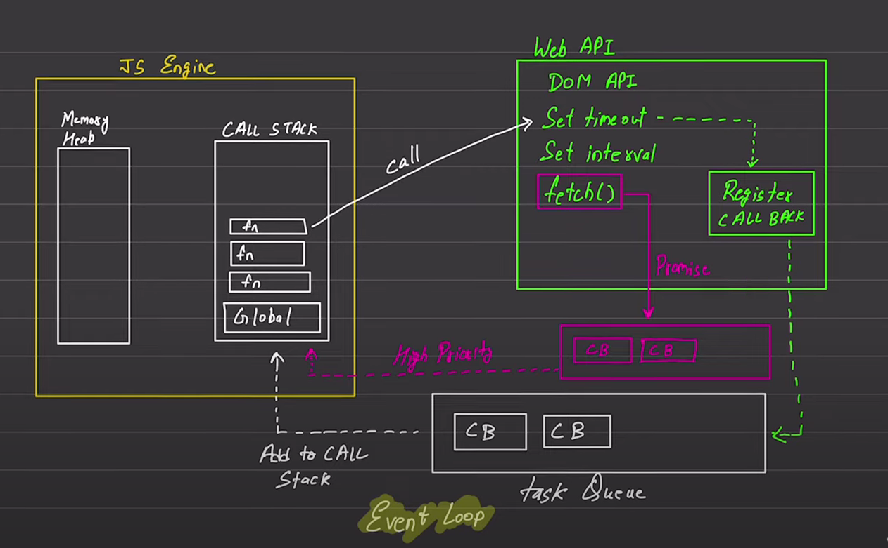

JavaScript:
    -> Synchronous
    -> Single Threaded

    -> This is default nature

Execution Context
    -> Execute one line of code at a time
        -> Console.log -> 1     (Each operation wait for the last one to complete before executing)
        -> Console.log -> 2

        -> [CallStack]      [Memory Heap]

Blocking                    vs              Non Blocking Code
(Block the flow of program)         (Does not Block Execution)
        |                                       |
    (Read File Sync)                        (Read file Async)

 (Event Loop)